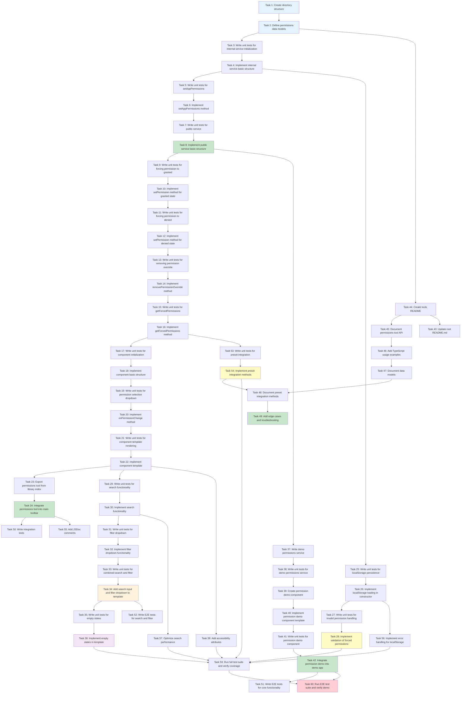

# Implementation Plan: Permissions Tool

**Feature**: Permissions Tool | **Branch**: `001-permissions-tool` | **Date**: 2025-10-12

This implementation plan follows a test-driven development (TDD) approach with tasks organized by priority and user story. Each task is designed to be executed by a coding agent and builds incrementally on previous tasks.

---

## Setup Phase

- [x] 1. Create directory structure for permissions tool
  - Create directory `libs/ngx-dev-toolbar/src/tools/permissions-tool/`
  - Create placeholder files for component, services, models, and tests
  - Verify directory structure matches expected layout
  - _Requirements: FR-011_

---

## Foundational Phase: Models and Base Services

- [x] 2. Define permissions data models
  - Create `libs/ngx-dev-toolbar/src/tools/permissions-tool/permissions.models.ts`
  - Define `DevToolbarPermission` interface with id, name, description, isGranted, isForced properties
  - Define `ForcedPermissionsState` interface with granted and denied arrays
  - Define `PermissionFilter` type union ('all' | 'forced' | 'granted' | 'denied')
  - Define `PermissionValue` type union ('not-forced' | 'granted' | 'denied')
  - Export all models from the file
  - _Requirements: FR-001, FR-002, FR-008_

- [x] 3. Write unit tests for internal service initialization
  - Create `libs/ngx-dev-toolbar/src/tools/permissions-tool/permissions-internal.service.spec.ts`
  - Write test: should initialize with empty permissions
  - Write test: should initialize with empty forced state
  - Write test: should load forced state from localStorage if available
  - Set up TestBed configuration with DevToolsStorageService mock
  - _Requirements: FR-005, FR-011 (TDD)_

- [x] 4. Implement internal service basic structure
  - Create `libs/ngx-dev-toolbar/src/tools/permissions-tool/permissions-internal.service.ts`
  - Implement `@Injectable({ providedIn: 'root' })` decorator
  - Inject DevToolsStorageService
  - Initialize signals for appPermissions (BehaviorSubject), forcedState (BehaviorSubject)
  - Create combined permissions$ observable that merges app + forced permissions
  - Convert combined observable to signal using toSignal()
  - Implement constructor with localStorage loading logic
  - _Requirements: FR-004, FR-005, FR-011_

- [x] 5. Write unit tests for internal service setAppPermissions method
  - Write test: should update appPermissions when setAppPermissions called
  - Write test: should preserve forced state when setAppPermissions called with new permissions
  - Write test: should combine app permissions with forced state correctly
  - Write test: should handle empty permissions array
  - _Requirements: FR-001 (TDD)_

- [x] 6. Implement internal service setAppPermissions method
  - Implement `setAppPermissions(permissions: DevToolbarPermission[]): void` method
  - Method should update appPermissions BehaviorSubject
  - Method should trigger recombination with forced state
  - Ensure immutable updates using spread operators
  - _Requirements: FR-001_

- [x] 7. Write unit tests for public service basic functionality
  - Create `libs/ngx-dev-toolbar/src/tools/permissions-tool/permissions.service.spec.ts`
  - Write test: should implement DevToolsService interface
  - Write test: setAvailableOptions should call internal service setAppPermissions
  - Write test: getForcedValues should return observable of forced permissions
  - Set up TestBed with DevToolbarInternalPermissionsService mock
  - _Requirements: FR-001, FR-006 (TDD)_

- [x] 8. Implement public service basic structure
  - Create `libs/ngx-dev-toolbar/src/tools/permissions-tool/permissions.service.ts`
  - Implement `@Injectable({ providedIn: 'root' })` decorator
  - Implement `DevToolsService<DevToolbarPermission>` interface
  - Inject DevToolbarInternalPermissionsService
  - Implement `setAvailableOptions(permissions: DevToolbarPermission[]): void` by delegating to internal service
  - Implement `getForcedValues(): Observable<DevToolbarPermission[]>` by delegating to internal service
  - _Requirements: FR-001, FR-006_

---

## User Story 1: Developer Forces Permission Override (P1)

- [x] 9. Write unit tests for forcing permission to granted
  - Add tests to `permissions-internal.service.spec.ts`
  - Write test: setPermission should add permission to granted array when granted=true
  - Write test: setPermission should remove permission from denied array if present
  - Write test: setPermission should update combined permissions signal
  - Write test: setPermission should persist to localStorage with key 'AngularDevTools.permissions'
  - _Requirements: FR-003, FR-004, FR-006 (TDD)_

- [x] 10. Implement internal service setPermission method for granted state
  - Implement `setPermission(id: string, granted: boolean): void` method
  - When granted=true: add id to forcedState.granted array, remove from denied array
  - Update forcedState BehaviorSubject
  - Persist updated state to localStorage using DevToolsStorageService
  - Trigger recombination of app + forced permissions
  - _Requirements: FR-003, FR-004, FR-006_

- [x] 11. Write unit tests for forcing permission to denied
  - Add tests to `permissions-internal.service.spec.ts`
  - Write test: setPermission should add permission to denied array when granted=false
  - Write test: setPermission should remove permission from granted array if present
  - Write test: setPermission should update combined permissions signal correctly
  - Write test: setPermission should persist denied state to localStorage
  - _Requirements: FR-003, FR-004, FR-006 (TDD)_

- [x] 12. Implement internal service setPermission method for denied state
  - Extend `setPermission(id: string, granted: boolean)` method
  - When granted=false: add id to forcedState.denied array, remove from granted array
  - Update forcedState BehaviorSubject
  - Persist updated state to localStorage
  - Ensure forced permissions are marked with isForced=true
  - _Requirements: FR-003, FR-004, FR-006_

- [x] 13. Write unit tests for removing permission override
  - Add tests to `permissions-internal.service.spec.ts`
  - Write test: removePermissionOverride should remove permission from both granted and denied arrays
  - Write test: removePermissionOverride should restore permission to original app state
  - Write test: removePermissionOverride should update localStorage
  - Write test: removePermissionOverride should emit updated permissions via getForcedPermissions
  - _Requirements: FR-003, FR-004 (TDD)_

- [x] 14. Implement internal service removePermissionOverride method
  - Implement `removePermissionOverride(id: string): void` method
  - Remove id from both forcedState.granted and forcedState.denied arrays
  - Update forcedState BehaviorSubject
  - Persist updated state to localStorage
  - Trigger recombination to restore original app permission state
  - _Requirements: FR-003, FR-004_

- [x] 15. Write unit tests for getForcedPermissions method
  - Add tests to `permissions-internal.service.spec.ts`
  - Write test: getForcedPermissions should return only permissions with isForced=true
  - Write test: getForcedPermissions should emit when forced state changes
  - Write test: getForcedPermissions should handle empty forced state
  - _Requirements: FR-006 (TDD)_

- [x] 16. Implement internal service getForcedPermissions method
  - Implement `getForcedPermissions(): Observable<DevToolbarPermission[]>` method
  - Filter combined permissions to return only those with isForced=true
  - Return observable that emits whenever forced state changes
  - Ensure observable completes properly on service destruction
  - _Requirements: FR-006_

- [x] 17. Write unit tests for permissions tool component initialization
  - Create `libs/ngx-dev-toolbar/src/tools/permissions-tool/permissions-tool.component.spec.ts`
  - Write test: should create component successfully
  - Write test: should initialize with permissions signal from internal service
  - Write test: should initialize with empty search query
  - Write test: should initialize with 'all' filter
  - Set up TestBed with DevToolbarInternalPermissionsService mock
  - _Requirements: FR-002, FR-007, FR-008 (TDD)_

- [x] 18. Implement permissions tool component basic structure
  - Create `libs/ngx-dev-toolbar/src/tools/permissions-tool/permissions-tool.component.ts`
  - Implement `@Component` decorator with selector 'ndt-permissions-tool'
  - Set changeDetection to ChangeDetectionStrategy.OnPush
  - Mark as standalone: true (implicit)
  - Inject DevToolbarInternalPermissionsService
  - Initialize searchQuery signal as WritableSignal<string>
  - Initialize activeFilter signal as WritableSignal<PermissionFilter>
  - Get permissions signal from internal service
  - Define window options with title, description, icon='users', size='medium'
  - _Requirements: FR-002, FR-007, FR-008, FR-011_

- [x] 19. Write unit tests for permission selection dropdown
  - Add tests to `permissions-tool.component.spec.ts`
  - Write test: onPermissionChange should call setPermission when value is 'granted'
  - Write test: onPermissionChange should call setPermission when value is 'denied'
  - Write test: onPermissionChange should call removePermissionOverride when value is 'not-forced'
  - Write test: onPermissionChange should not call service methods for invalid permission id
  - _Requirements: FR-003 (TDD)_

- [x] 20. Implement permissions tool component onPermissionChange method
  - Implement `protected onPermissionChange(id: string, value: PermissionValue): void` method
  - When value='granted': call internalService.setPermission(id, true)
  - When value='denied': call internalService.setPermission(id, false)
  - When value='not-forced': call internalService.removePermissionOverride(id)
  - Validate that permission id exists before calling service methods
  - _Requirements: FR-003_

- [x] 21. Write unit tests for permissions tool component template rendering
  - Add tests to `permissions-tool.component.spec.ts`
  - Write test: should render DevToolbarToolComponent with correct options
  - Write test: should render list of permissions with name and description
  - Write test: should render select dropdown for each permission
  - Write test: should render correct current value in select dropdown based on isForced and isGranted
  - _Requirements: FR-002, FR-003 (TDD)_

- [x] 22. Implement permissions tool component template
  - Create inline template in component
  - Wrap content in `<ndt-toolbar-tool [options]="options" title="Permissions" icon="users">`
  - Create container div with flex column layout
  - Add @for loop to iterate over filteredPermissions()
  - For each permission, render ndt-clickable-card or ndt-card with permission name and description
  - Add ndt-select component for each permission with options: Not Forced, Granted, Denied
  - Bind select value to computed current state (forced/granted/denied)
  - Wire (valueChange) event to onPermissionChange method
  - _Requirements: FR-002, FR-003_

- [x] 23. Export permissions tool from library index
  - Modify `libs/ngx-dev-toolbar/src/index.ts`
  - Add export for `DevToolbarPermissionsToolComponent`
  - Add export for `DevToolbarPermissionsService`
  - Add export for permissions models: `DevToolbarPermission`
  - _Requirements: FR-011_

- [x] 24. Integrate permissions tool into main toolbar component
  - Modify `libs/ngx-dev-toolbar/src/dev-toolbar.component.ts`
  - Import DevToolbarPermissionsToolComponent
  - Add permissions tool to imports array
  - Add permissions case to tool switching logic in template
  - Add permissions button to home tool with icon='users', label='Permissions'
  - _Requirements: FR-011_

---

## User Story 3: Persist Permission Overrides (P1)

- [x] 25. Write unit tests for localStorage persistence on initialization
  - Add tests to `permissions-internal.service.spec.ts`
  - Write test: should load forced state from localStorage on initialization
  - Write test: should handle corrupted localStorage data gracefully
  - Write test: should handle missing localStorage data gracefully
  - Write test: should log warning when localStorage contains invalid JSON
  - _Requirements: FR-005 (TDD)_

- [x] 26. Implement localStorage loading in internal service constructor
  - Enhance constructor to load forced state from localStorage with key 'AngularDevTools.permissions'
  - Use DevToolsStorageService.getItem to retrieve stored state
  - Parse JSON and validate structure matches ForcedPermissionsState
  - If valid, initialize forcedState BehaviorSubject with loaded data
  - If invalid or missing, initialize with empty state { granted: [], denied: [] }
  - Add error handling for JSON parse errors
  - _Requirements: FR-005_

- [x] 27. Write unit tests for persisting invalid permission overrides
  - Add tests to `permissions-internal.service.spec.ts`
  - Write test: should ignore forced permissions that don't exist in available options on page load
  - Write test: should log warning for invalid permission IDs in forced state
  - Write test: should clean up invalid permission IDs from localStorage after validation
  - _Requirements: FR-005 (edge case handling)_

- [x] 28. Implement validation of forced permissions on initialization
  - In constructor after loading localStorage, validate forced permission IDs
  - Compare forced state IDs against available app permissions
  - Remove any IDs from forcedState.granted and forcedState.denied that don't exist in app permissions
  - If cleanup occurred, persist cleaned state back to localStorage
  - Log warning message for invalid permission IDs found
  - _Requirements: FR-005 (edge case handling)_

---

## User Story 2: Search and Filter Permissions (P2)

- [x] 29. Write unit tests for search functionality
  - Add tests to `permissions-tool.component.spec.ts`
  - Write test: onSearchChange should update searchQuery signal
  - Write test: filteredPermissions should include only permissions matching search query by name (case-insensitive)
  - Write test: filteredPermissions should include permissions matching search query by description (case-insensitive)
  - Write test: filteredPermissions should show all permissions when search query is empty
  - _Requirements: FR-007 (TDD)_

- [x] 30. Implement search functionality in component
  - Implement `protected onSearchChange(query: string): void` method to update searchQuery signal
  - Create `protected readonly filteredPermissions: Signal<DevToolbarPermission[]>` computed signal
  - In computed, filter permissions() based on searchQuery()
  - Match against permission.name and permission.description (case-insensitive)
  - Handle null/undefined descriptions gracefully
  - _Requirements: FR-007_

- [x] 31. Write unit tests for filter dropdown functionality
  - Add tests to `permissions-tool.component.spec.ts`
  - Write test: onFilterChange should update activeFilter signal
  - Write test: filteredPermissions should show all permissions when filter is 'all'
  - Write test: filteredPermissions should show only forced permissions when filter is 'forced'
  - Write test: filteredPermissions should show only granted permissions when filter is 'granted'
  - Write test: filteredPermissions should show only denied permissions when filter is 'denied'
  - _Requirements: FR-008 (TDD)_

- [x] 32. Implement filter dropdown functionality in component
  - Implement `protected onFilterChange(filter: PermissionFilter): void` method to update activeFilter signal
  - Enhance filteredPermissions computed signal to apply filter
  - When filter='all': show all permissions
  - When filter='forced': show only permissions with isForced=true
  - When filter='granted': show only permissions with isGranted=true
  - When filter='denied': show only permissions with isGranted=false
  - _Requirements: FR-008_

- [x] 33. Write unit tests for combined search and filter
  - Add tests to `permissions-tool.component.spec.ts`
  - Write test: filteredPermissions should apply both search and filter together
  - Write test: clearing search should preserve active filter
  - Write test: changing filter should preserve search query
  - _Requirements: FR-007, FR-008 (TDD)_

- [x] 34. Add search input and filter dropdown to component template
  - Enhance component template with search and filter UI
  - Add ndt-input component with placeholder="Search permissions..." wired to onSearchChange
  - Add ndt-select component with filter options: All, Forced, Granted, Denied wired to onFilterChange
  - Position search and filter in a header section above the permissions list
  - Use flex layout to arrange search and filter horizontally
  - _Requirements: FR-007, FR-008_

---

## User Story 6: Empty States and Loading (P3)

- [x] 35. Write unit tests for empty states
  - Add tests to `permissions-tool.component.spec.ts`
  - Write test: should show "No permissions found" message when permissions array is empty
  - Write test: should show "No permissions match your filter" when search/filter produces no results
  - Write test: should show permissions list when results exist
  - _Requirements: FR-009, FR-010 (TDD)_

- [x] 36. Implement empty states in component template
  - Add conditional rendering to template using @if
  - When permissions().length === 0: show "No permissions found" message with suggestion to call setAvailableOptions
  - When permissions().length > 0 but filteredPermissions().length === 0: show "No permissions match your filter" message
  - When filteredPermissions().length > 0: show permissions list
  - Style empty state messages with muted text color and centered alignment
  - _Requirements: FR-009, FR-010_

---

## User Story 4: Demo App Integration (P1)

- [x] 37. Write demo permissions service
  - Create `apps/ngx-dev-toolbar-demo/src/app/services/demo-permissions.service.ts`
  - Implement @Injectable({ providedIn: 'root' })
  - Inject DevToolbarPermissionsService
  - Define 5 realistic sample permissions (can-edit-posts, can-delete-posts, can-manage-users, can-view-analytics, is-admin)
  - Create permissions signal with Record<string, boolean> type
  - In constructor, call setAvailableOptions with all 5 permissions
  - Subscribe to getForcedValues() and update local permissions signal
  - Implement hasPermission(id: string): boolean method
  - Add code comments explaining integration points
  - _Requirements: FR-013, FR-014, FR-015, FR-016_

- [x] 38. Write unit tests for demo permissions service
  - Create `apps/ngx-dev-toolbar-demo/src/app/services/demo-permissions.service.spec.ts`
  - Write test: should initialize with sample permissions
  - Write test: should call setAvailableOptions in constructor
  - Write test: should update permissions signal when forced values change
  - Write test: hasPermission should return correct boolean value
  - _Requirements: FR-013, FR-016 (TDD)_

- [x] 39. Create permission demo component
  - Create `apps/ngx-dev-toolbar-demo/src/app/components/permission-demo/permission-demo.component.ts`
  - Implement @Component with standalone: true, OnPush change detection
  - Inject DemoPermissionsService
  - Create computed signals for each permission check (canEdit, canDelete, canManageUsers, canViewAnalytics, isAdmin)
  - Each computed signal should call demoPermService.hasPermission with appropriate id
  - _Requirements: FR-014_

- [x] 40. Implement permission demo component template
  - Create inline template in permission-demo.component.ts
  - Add section with heading "Permissions Demo"
  - Add buttons that appear conditionally based on permissions:
    - @if (canEdit()): show "Edit Post" button
    - @if (canDelete()): show "Delete Post" button
    - @if (canManageUsers()): show "Manage Users" button
  - Add analytics dashboard section that appears @if (canViewAnalytics())
  - Add admin panel section that appears @if (isAdmin())
  - Style buttons with appropriate colors (primary, danger, secondary)
  - _Requirements: FR-014_

- [x] 41. Write unit tests for permission demo component
  - Create `apps/ngx-dev-toolbar-demo/src/app/components/permission-demo/permission-demo.component.spec.ts`
  - Write test: should create component
  - Write test: should show Edit Post button when canEdit is true
  - Write test: should hide Edit Post button when canEdit is false
  - Write test: should show Admin Panel when isAdmin is true
  - Write test: computed signals should call hasPermission with correct IDs
  - _Requirements: FR-014 (TDD)_

- [x] 42. Integrate permission demo component into demo app
  - Modify `apps/ngx-dev-toolbar-demo/src/app/app.component.ts`
  - Import PermissionDemoComponent
  - Add PermissionDemoComponent to imports array
  - Add <app-permission-demo> to app.component.html template
  - Position demo component prominently on the page
  - _Requirements: FR-014_

---

## User Story 5: Documentation and Usage Guidance (P1)

- [x] 43. Update root README.md with permissions tool section
  - Modify `/Users/alfredoperez/dev/GitHub/ngx-dev-toolbar/README.md`
  - Add "Permissions Tool" subsection under "Available Tools"
  - Include brief description: "Test permission-based UI and access control without backend changes"
  - Add icon reference: 🔐 (users icon)
  - Add basic configuration code example with setAvailableOptions
  - Add basic usage code example with getForcedValues
  - _Requirements: FR-017_

- [x] 44. Create tools README with comprehensive documentation
  - Create `/Users/alfredoperez/dev/GitHub/ngx-dev-toolbar/libs/ngx-dev-toolbar/src/tools/README.md`
  - Add overview section explaining all available tools
  - Add tool architecture patterns section explaining 3-layer architecture
  - Add "Permissions Tool" section with full API documentation
  - _Requirements: FR-018, FR-019_

- [x] 45. Document permissions tool API in tools README
  - In tools README, document DevToolbarPermissionsService class
  - Document method signature: `setAvailableOptions(permissions: DevToolbarPermission[]): void`
  - Document method signature: `getForcedValues(): Observable<DevToolbarPermission[]>`
  - Include parameter types and return types
  - Add description for each method explaining purpose and behavior
  - _Requirements: FR-019_

- [x] 46. Add TypeScript usage examples to tools README
  - In tools README, add "Basic Usage" example showing simple permission forcing
  - Add "Advanced Usage" example showing integration with auth service
  - Add "Preset Integration" example showing applyPresetPermissions usage
  - Include complete code samples with imports and proper TypeScript typing
  - _Requirements: FR-020_

- [x] 47. Document data models in tools README
  - In tools README, add "Data Models" section
  - Document DevToolbarPermission interface with all properties and their types
  - Document ForcedPermissionsState interface
  - Include descriptions for each property explaining purpose and constraints
  - _Requirements: FR-021_

- [x] 48. Document preset integration methods in tools README
  - In tools README, add "Preset Integration" section
  - Document `applyPresetPermissions(state: ForcedPermissionsState): void` method
  - Document `getCurrentForcedState(): ForcedPermissionsState` method
  - Explain use cases for preset integration (automated testing, saved configurations)
  - Include code example showing how to save and restore permission states
  - _Requirements: FR-022, FR-012_

- [x] 49. Add edge cases and troubleshooting to tools README
  - In tools README, add "Edge Cases & Troubleshooting" section
  - Document behavior when permission is forced but removed from available options
  - Document behavior when duplicate permission IDs are provided
  - Document behavior when setAvailableOptions is called multiple times
  - Document behavior when permissions have missing names
  - Document behavior when localStorage quota is exceeded
  - Include recommended handling strategies for each edge case
  - _Requirements: FR-022 (edge cases from spec)_

---

## Testing Phase: Integration and E2E

- [ ] 50. Write integration tests for full permission forcing workflow
  - Add integration tests to `permissions.service.spec.ts`
  - Write test: full workflow - configure permissions, force to granted, verify emission, persist, reload
  - Write test: full workflow - force permission to denied, clear override, verify restoration
  - Write test: full workflow - force multiple permissions, verify localStorage contains all
  - Set up proper TestBed configuration with real DevToolsStorageService
  - _Requirements: FR-001 through FR-006_

- [ ] 51. Write E2E tests for permissions tool
  - Create `apps/ngx-dev-toolbar-demo-e2e/src/permissions-tool.spec.ts`
  - Write test: should open permissions tool and display configured permissions
  - Write test: should force permission to granted and show corresponding UI element in demo
  - Write test: should force permission to denied and hide corresponding UI element in demo
  - Write test: should clear forced permission and restore default state in demo
  - Write test: should persist forced permissions across page refresh
  - Use Playwright selectors and assertions
  - _Requirements: FR-001 through FR-006, FR-013 through FR-016_

- [ ] 52. Write E2E tests for search and filter functionality
  - Add tests to `permissions-tool.spec.ts`
  - Write test: should filter permissions by search query
  - Write test: should filter permissions by dropdown selection
  - Write test: should combine search and filter correctly
  - Write test: should show empty state when no results match
  - _Requirements: FR-007, FR-008, FR-009, FR-010_

---

## Preset Integration Implementation

- [x] 53. Write unit tests for preset integration methods
  - Add tests to `permissions-internal.service.spec.ts`
  - Write test: applyPresetPermissions should replace current forced state with provided state
  - Write test: applyPresetPermissions should persist new state to localStorage
  - Write test: applyPresetPermissions should emit updated forced permissions
  - Write test: getCurrentForcedState should return current ForcedPermissionsState object
  - Write test: getCurrentForcedState should return deep copy to prevent external mutations
  - _Requirements: FR-012 (TDD)_

- [x] 54. Implement preset integration methods in internal service
  - Implement `applyPresetPermissions(state: ForcedPermissionsState): void` method
  - Method should replace entire forcedState BehaviorSubject with provided state
  - Persist new state to localStorage
  - Trigger recombination of app + forced permissions
  - Implement `getCurrentForcedState(): ForcedPermissionsState` method
  - Return deep copy of current forcedState to prevent mutations
  - _Requirements: FR-012_

---

## Polish and Finalization

- [x] 55. Add comprehensive JSDoc comments to all public APIs
  - Add JSDoc comments to DevToolbarPermissionsService methods
  - Add JSDoc comments to DevToolbarPermission interface properties
  - Add JSDoc comments to ForcedPermissionsState interface properties
  - Include @param and @returns tags where applicable
  - _Requirements: FR-019_

- [x] 56. Implement error handling for localStorage quota exceeded
  - Enhance localStorage persistence in internal service
  - Wrap DevToolsStorageService.setItem calls in try-catch blocks
  - If QuotaExceededError occurs, log warning to console
  - Continue operation with in-memory state only
  - Add test for quota exceeded scenario
  - _Requirements: Edge case handling (SC-005)_

- [x] 57. Optimize search performance for large permission lists
  - Review filteredPermissions computed signal implementation
  - Ensure search uses efficient string matching (toLowerCase once per permission)
  - Add memoization if needed for expensive operations
  - Test with 100+ permissions to verify <100ms search time
  - _Requirements: SC-003_

- [x] 58. Add accessibility attributes to permission controls
  - Review component template for accessibility
  - Add aria-label to search input: "Search permissions"
  - Add aria-label to filter select: "Filter permissions by state"
  - Add aria-label to permission select dropdowns: "Override state for {permission.name}"
  - Verify keyboard navigation works for all interactive elements
  - _Requirements: Best practices_

- [x] 59. Run full test suite and verify coverage
  - Execute `nx test ngx-dev-toolbar` to run all unit tests
  - Verify permissions-internal.service coverage >80%
  - Verify permissions.service coverage >80%
  - Verify permissions-tool.component coverage >70%
  - Fix any failing tests
  - Address any coverage gaps in critical code paths
  - _Requirements: SC-005 (TDD with >80% coverage)_

- [x] 60. Run E2E test suite and verify demo app integration
  - Execute `nx e2e ngx-dev-toolbar-demo-e2e` to run E2E tests
  - Verify all permissions tool E2E tests pass
  - Manually test demo app to verify UI responds to permission changes within 100ms
  - Verify zero console errors in demo app
  - Verify toolbar opens and closes smoothly with permissions tool
  - _Requirements: SC-007, SC-008_

---

## Tasks Dependency Diagram

**Legend:**
- Blue: Setup and foundational tasks
- Green: P1 user story completion milestones
- Yellow: P1 persistence implementation
- Orange: P2 search and filter
- Purple: P3 empty states
- Red: Final testing and verification

---

## Summary

This implementation plan contains **60 tasks** organized into:

- **Setup Phase**: 1 task (directory structure)
- **Foundational Phase**: 7 tasks (models, base services)
- **User Story 1 (P1)**: 16 tasks (core permission forcing functionality)
- **User Story 3 (P1)**: 4 tasks (localStorage persistence)
- **User Story 2 (P2)**: 6 tasks (search and filter)
- **User Story 6 (P3)**: 2 tasks (empty states)
- **User Story 4 (P1)**: 6 tasks (demo app integration)
- **User Story 5 (P1)**: 7 tasks (documentation)
- **Testing Phase**: 3 tasks (integration and E2E tests)
- **Preset Integration**: 2 tasks (preset methods)
- **Polish and Finalization**: 6 tasks (JSDoc, error handling, optimization, accessibility, test verification)

**Parallelizable Tasks**: Tasks 3-7 (internal service tests), 29-33 (search/filter tests), 37-41 (demo app tests), and 43-49 (documentation) can be executed in parallel by different agents.

**Critical Path**: Tasks 1→2→4→6→8→10→12→14→16→18→20→22→23→24 form the critical path to get the basic tool functional and integrated.

**Estimated Complexity**: Medium - follows established patterns from feature-flags-tool, leveraging existing components and services.
