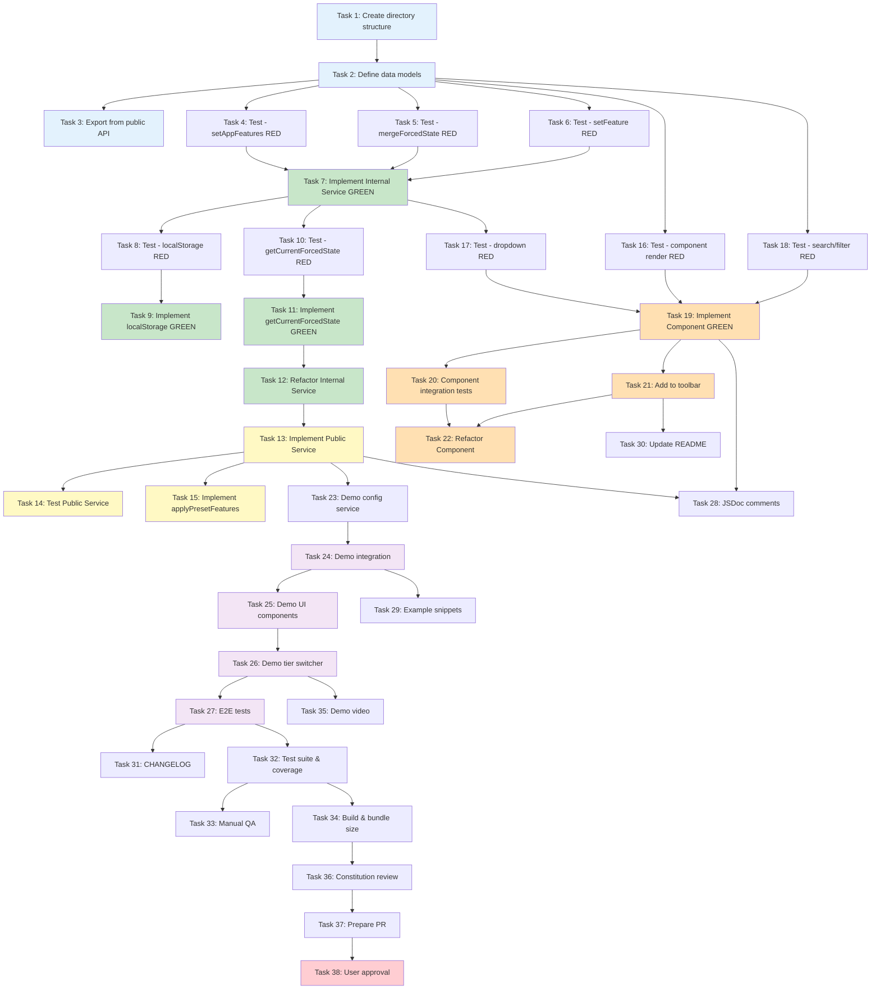

# Implementation Tasks: App Features Tool

**Feature**: App Features Tool | **Branch**: `002-app-features-tool` | **Date**: 2025-10-12

## Overview

This document contains actionable, dependency-ordered tasks for implementing the App Features Tool. Tasks are organized by user story priority (P1 → P2 → P3) and follow Test-First Development (TDD) methodology. Each task builds incrementally on previous tasks with no orphaned code.

**Key Principles**:
- ✅ Write tests FIRST for each user story (Red → Green → Refactor)
- ✅ Copy feature-flags-tool pattern exactly (dual-service, signals, OnPush)
- ✅ Tasks marked with [P] can be parallelized
- ✅ Each user story phase is independently testable
- ✅ Map all tasks to their user story requirement

**Expected Timeline**: ~8-12 hours for complete implementation + testing + demo integration

---

## Phase 0: Setup & Foundation (30 minutes)

### Task 1: Create directory structure and base files

Create the complete file structure for the app-features-tool following the established toolbar pattern.

**Actions**:
- Create directory: `libs/ngx-dev-toolbar/src/tools/app-features-tool/`
- Create file: `app-features.models.ts` (empty, content in Task 2)
- Create file: `app-features-internal.service.ts` (empty, content in Task 7)
- Create file: `app-features-internal.service.spec.ts` (empty, content in Task 8)
- Create file: `app-features.service.ts` (empty, content in Task 13)
- Create file: `app-features.service.spec.ts` (empty, content in Task 14)
- Create file: `app-features-tool.component.ts` (empty, content in Task 19)
- Create file: `app-features-tool.component.spec.ts` (empty, content in Task 20)

**Requirements**: None
**User Stories**: Foundation for all user stories
**Verification**: All files exist and TypeScript compilation succeeds (empty files)

---

### Task 2: Define core data models and types

Implement TypeScript interfaces and types in `app-features.models.ts` following the data-model.md specification.

**Actions**:
- Define `DevToolbarAppFeature` interface with id, name, description?, isEnabled, isForced
- Define `AppFeatureFilter` type union: 'all' | 'forced' | 'enabled' | 'disabled'
- Define `ForcedAppFeaturesState` interface with enabled: string[], disabled: string[]
- Add JSDoc comments for all types explaining purpose and usage
- Export all types for public API consumption

**Requirements**: Task 1 complete
**User Stories**: Foundation (supports FR-001, FR-002, FR-003)
**Verification**: TypeScript compilation passes, types are properly exported

---

### Task 3: Export app features tool from public API

Add app features tool exports to the library's public API index file.

**Actions**:
- Open `libs/ngx-dev-toolbar/src/index.ts`
- Add export statements for:
  - `DevToolbarAppFeature` type
  - `AppFeatureFilter` type
  - `ForcedAppFeaturesState` type
  - `DevToolbarAppFeaturesService` class
  - `DevToolbarAppFeaturesToolComponent` class (component export added in Task 21)

**Requirements**: Task 2 complete
**User Stories**: Foundation (required for consuming applications to import types/services)
**Verification**: Import statement `import { DevToolbarAppFeature } from 'ngx-dev-toolbar';` works in demo app

---

## Phase 1: Internal Service - State Management (User Story 1 - Core Forcing, User Story 3 - Persistence) (2 hours)

### Task 4: [P] Write unit test: setAppFeatures() validates and stores features (TDD - RED)

Write failing tests for `setAppFeatures()` method covering validation and storage logic.

**Test Cases**:
1. Should accept valid features array and emit to BehaviorSubject
2. Should throw error on duplicate feature IDs
3. Should throw error on empty feature ID
4. Should trim whitespace from feature names
5. Should log warning for empty feature names (non-blocking)

**Requirements**: Task 2 complete (models exist)
**User Stories**: US1 (FR-002), US3 (foundation for persistence)
**Verification**: Tests written, all tests fail (RED state)

---

### Task 5: [P] Write unit test: mergeForcedState() combines natural and forced state (TDD - RED)

Write failing tests for private `mergeForcedState()` helper method.

**Test Cases**:
1. Should return features with isForced=false when no forced state exists
2. Should set isEnabled=true and isForced=true for features in enabled array
3. Should set isEnabled=false and isForced=true for features in disabled array
4. Should preserve natural isEnabled when feature not in forced state
5. Should handle mixed forced state (some enabled, some disabled)

**Requirements**: Task 2 complete
**User Stories**: US1 (FR-003 - core forcing logic)
**Verification**: Tests written, all tests fail (RED state)

---

### Task 6: [P] Write unit test: setFeature() and removeFeatureOverride() manage forced state (TDD - RED)

Write failing tests for forcing/unforcing features.

**Test Cases**:
1. Should add feature ID to enabled array when setFeature(id, true) called
2. Should add feature ID to disabled array when setFeature(id, false) called
3. Should move feature from disabled to enabled when forcing to enabled
4. Should remove feature from both arrays when removeFeatureOverride() called
5. Should persist forced state to localStorage after each change

**Requirements**: Task 2 complete
**User Stories**: US1 (FR-003, FR-006), US3 (FR-004)
**Verification**: Tests written, all tests fail (RED state)

---

### Task 7: Implement DevToolbarInternalAppFeaturesService (TDD - GREEN)

Implement the internal service following contracts/internal-api.md specification to make tests pass.

**Implementation Steps**:
1. Inject `DevToolsStorageService` in constructor
2. Define STORAGE_KEY constant = 'app-features'
3. Create private `appFeaturesSubject` BehaviorSubject
4. Create private `forcedFeaturesSubject` BehaviorSubject
5. Create `features$` observable with `combineLatest` + `mergeForcedState()` pipe
6. Convert `features$` to public signal using `toSignal()`
7. Implement `setAppFeatures()` with validation logic (make Task 4 tests pass)
8. Implement private `mergeForcedState()` helper (make Task 5 tests pass)
9. Implement `setFeature()` and `removeFeatureOverride()` (make Task 6 tests pass)
10. Implement private `saveForcedFeatures()` with try-catch for QuotaExceededError
11. Call `loadForcedFeatures()` in constructor
12. Implement `getAppFeatures()` returning `appFeatures$` observable
13. Implement `getForcedFeatures()` returning filtered `features$` where isForced=true

**Requirements**: Tasks 4-6 complete (tests written)
**User Stories**: US1 (FR-002, FR-003, FR-006), US3 (FR-004)
**Verification**: Run tests - all tests from Tasks 4-6 now pass (GREEN state)

---

### Task 8: [P] Write unit test: localStorage persistence and loading (TDD - RED)

Write failing tests for localStorage loading and validation logic.

**Test Cases**:
1. Should load forced state from localStorage on initialization
2. Should handle missing localStorage gracefully (no error thrown)
3. Should handle corrupted JSON in localStorage (log error, use empty state)
4. Should emit loaded forced state to forcedFeaturesSubject
5. Should validate and clean invalid feature IDs after setAppFeatures() called
6. Should log warning when removing invalid feature IDs
7. Should persist cleaned forced state back to localStorage

**Requirements**: Task 7 complete (service skeleton exists)
**User Stories**: US3 (FR-004, FR-005, FR-015, FR-016)
**Verification**: Tests written, tests fail for loadForcedFeatures() and validateAndCleanForcedState() methods

---

### Task 9: Implement localStorage loading and validation (TDD - GREEN)

Implement `loadForcedFeatures()` and `validateAndCleanForcedState()` private methods.

**Implementation Steps**:
1. Implement `loadForcedFeatures()`:
   - Use `storageService.get<ForcedAppFeaturesState>(STORAGE_KEY)`
   - Wrap in try-catch, log errors to console
   - Emit loaded state to `forcedFeaturesSubject` if valid
   - Handle null/undefined gracefully (use empty state)
2. Implement `validateAndCleanForcedState()`:
   - Get configured feature IDs from `appFeaturesSubject.value`
   - Get current forced state from `forcedFeaturesSubject.value`
   - Filter enabled array to only valid IDs
   - Filter disabled array to only valid IDs
   - If any IDs removed, log warning with removed IDs list
   - Emit cleaned state to `forcedFeaturesSubject`
   - Persist cleaned state via `saveForcedFeatures()`
3. Call `validateAndCleanForcedState()` at end of `setAppFeatures()` method

**Requirements**: Task 8 complete (tests written)
**User Stories**: US3 (FR-005, FR-015, FR-016)
**Verification**: All tests from Task 8 now pass (GREEN state), localStorage validation working

---

### Task 10: [P] Write unit test: getCurrentForcedState() returns snapshot (TDD - RED)

Write failing tests for preset integration method.

**Test Cases**:
1. Should return empty state when no features forced
2. Should return current forced state with enabled/disabled arrays
3. Should return defensive copy (mutations don't affect internal state)
4. Should match structure: { enabled: string[], disabled: string[] }

**Requirements**: Task 7 complete
**User Stories**: US4 (FR-012 - preset integration)
**Verification**: Tests written, getCurrentForcedState() test fails (method not implemented yet)

---

### Task 11: Implement getCurrentForcedState() method (TDD - GREEN)

Implement method to return snapshot of current forced state.

**Implementation Steps**:
1. Add `getCurrentForcedState()` public method to internal service
2. Get current value from `forcedFeaturesSubject.value`
3. Return defensive copy: `{ enabled: [...state.enabled], disabled: [...state.disabled] }`

**Requirements**: Task 10 complete (test written)
**User Stories**: US4 (FR-012)
**Verification**: Task 10 tests now pass (GREEN state)

---

### Task 12: Refactor internal service for code quality (TDD - REFACTOR)

Clean up and optimize internal service implementation while keeping all tests passing.

**Refactoring Actions**:
- Extract magic numbers/strings to constants
- Add comprehensive JSDoc comments to all public methods
- Add JSDoc comments to private methods explaining logic
- Ensure immutable state updates (no mutations)
- Optimize `mergeForcedState()` if needed (performance)
- Verify consistent error handling patterns
- Check code follows Angular style guide

**Requirements**: Tasks 4-11 complete (all tests passing)
**User Stories**: Code quality for US1, US3, US4
**Verification**: All tests still pass, code passes lint, JSDoc comments complete

---

## Phase 2: Public Service - DevToolsService API (User Story 1, 3, 4) (1 hour)

### Task 13: Implement DevToolbarAppFeaturesService public API

Create public service implementing `DevToolsService<DevToolbarAppFeature>` interface.

**Implementation Steps**:
1. Add `@Injectable({ providedIn: 'root' })` decorator
2. Implement `DevToolsService<DevToolbarAppFeature>` interface
3. Inject `DevToolbarInternalAppFeaturesService` as private dependency
4. Implement `setAvailableOptions(features: DevToolbarAppFeature[]): void`:
   - Delegate to `internalService.setAppFeatures(features)`
5. Implement `getForcedValues(): Observable<DevToolbarAppFeature[]>`:
   - Return `internalService.getForcedFeatures()`
6. Implement `applyPresetFeatures(state: ForcedAppFeaturesState): void`:
   - Delegate to `internalService.applyForcedState(state)`
7. Implement `getCurrentForcedState(): ForcedAppFeaturesState`:
   - Return `internalService.getCurrentForcedState()`
8. Add JSDoc comments for all public methods following contracts/public-api.md

**Requirements**: Task 12 complete (internal service fully implemented)
**User Stories**: US1 (FR-001, FR-002, FR-006), US3 (FR-004, FR-005), US4 (FR-012)
**Verification**: Service compiles, implements DevToolsService interface correctly

---

### Task 14: Write unit tests for public service API contract

Write comprehensive tests for public service ensuring contract compliance.

**Test Cases**:
1. Should implement DevToolsService interface
2. Should expose setAvailableOptions() method
3. Should expose getForcedValues() method returning Observable
4. Should expose applyPresetFeatures() method
5. Should expose getCurrentForcedState() method
6. Should throw error on duplicate feature IDs via setAvailableOptions()
7. Should emit forced features when feature forced via internal service
8. Should apply preset state and trigger getForcedValues() emission
9. Should return current forced state matching internal service state

**Requirements**: Task 13 complete
**User Stories**: US1, US3, US4 (all core API requirements)
**Verification**: All public API tests pass, contract compliance verified

---

### Task 15: [P] Implement applyPresetFeatures() in internal service

Add preset batch operation method to internal service.

**Implementation Steps**:
1. Add `applyForcedState(state: ForcedAppFeaturesState): void` to internal service
2. Get configured feature IDs from `appFeaturesSubject.value`
3. Validate enabled array - filter to only valid IDs, log warnings for invalid
4. Validate disabled array - filter to only valid IDs, log warnings for invalid
5. Create cleaned state object with valid IDs only
6. Emit cleaned state to `forcedFeaturesSubject` (overwrites current state)
7. Persist cleaned state via `saveForcedFeatures()`

**Requirements**: Task 13 complete (public service delegates to this method)
**User Stories**: US4 (FR-012 - preset integration)
**Verification**: Public service applyPresetFeatures() works, invalid IDs filtered with warnings

---

## Phase 3: Component UI - Search, Filter, 3-State Controls (User Story 1, 2, 5) (2.5 hours)

### Task 16: [P] Write component unit test: initial render and empty states (TDD - RED)

Write failing tests for component rendering and empty state scenarios.

**Test Cases**:
1. Should render component with DevToolbarToolComponent wrapper
2. Should display "No app features found" when no features configured (US5)
3. Should display hint "Call setAvailableOptions() to configure features" in empty state
4. Should display "No features match your filter" when search/filter returns no results (US5)
5. Should render features list when features exist
6. Should display feature name, description, and 3-state dropdown for each feature

**Requirements**: Task 2 complete (models exist)
**User Stories**: US1 (FR-011 - UI rendering), US5 (FR-009, FR-010)
**Verification**: Tests written, component tests fail (component not implemented yet)

---

### Task 17: [P] Write component unit test: 3-state dropdown interactions (TDD - RED)

Write failing tests for forcing features via dropdown.

**Test Cases**:
1. Should call internalService.setFeature(id, true) when dropdown changed to "Enabled"
2. Should call internalService.setFeature(id, false) when dropdown changed to "Disabled"
3. Should call internalService.removeFeatureOverride(id) when dropdown changed to "Not Forced"
4. Should display "Not Forced" when feature.isForced === false
5. Should display "Enabled" when feature.isForced === true && feature.isEnabled === true
6. Should display "Disabled" when feature.isForced === true && feature.isEnabled === false

**Requirements**: Task 7 complete (internal service exists)
**User Stories**: US1 (FR-003, FR-006)
**Verification**: Tests written, dropdown interaction tests fail (not implemented)

---

### Task 18: [P] Write component unit test: search and filter functionality (TDD - RED)

Write failing tests for search and filter features.

**Test Cases**:
1. Should filter features by name (case-insensitive) when search query entered (US2)
2. Should filter features by description (case-insensitive) when search query entered
3. Should show only forced features when "Forced" filter selected (US2)
4. Should show only enabled features when "Enabled" filter selected
5. Should show only disabled features when "Disabled" filter selected
6. Should combine search query and filter (AND logic) (US2)
7. Should debounce search input (optional optimization)
8. Should display feature count: "X features" or "X of Y features" when filtered

**Requirements**: Task 2 complete (AppFeatureFilter type exists)
**User Stories**: US2 (FR-007, FR-008)
**Verification**: Tests written, search/filter tests fail (logic not implemented)

---

### Task 19: Implement DevToolbarAppFeaturesToolComponent (TDD - GREEN)

Create component with full UI implementation to make all component tests pass.

**Implementation Steps**:
1. Add `@Component` decorator with:
   - selector: 'ndt-app-features-tool'
   - imports: [DevToolbarToolComponent, DevToolbarInputComponent, DevToolbarSelectComponent, DevToolbarCardComponent, CommonModule]
   - changeDetection: ChangeDetectionStrategy.OnPush
2. Inject `DevToolbarInternalAppFeaturesService`
3. Create `searchQuery` signal = signal('')
4. Create `filterType` signal = signal<AppFeatureFilter>('all')
5. Create `filteredFeatures` computed signal:
   - Get features from `internalService.features()`
   - Apply search filter (name + description, case-insensitive)
   - Apply filterType filter (all/forced/enabled/disabled)
   - Return filtered array
6. Implement `onFeatureChange(featureId: string, value: 'on' | 'off' | '')`:
   - If value === 'on': call `internalService.setFeature(id, true)`
   - If value === 'off': call `internalService.setFeature(id, false)`
   - If value === '': call `internalService.removeFeatureOverride(id)`
7. Implement template:
   - Wrap in `<ndt-toolbar-tool icon="puzzle" title="App Features">`
   - Add search input bound to `searchQuery`
   - Add filter select bound to `filterType` with options: All/Forced/Enabled/Disabled
   - Add `@if (filteredFeatures().length === 0)` for empty state
   - Add `@for (feature of filteredFeatures())` loop
   - Render feature cards with name, description, and dropdown
   - Bind dropdown to feature state (Not Forced/Enabled/Disabled)
8. Add feature count display: "{{ filteredFeatures().length }} features"

**Requirements**: Tasks 16-18 complete (tests written)
**User Stories**: US1 (FR-003, FR-011), US2 (FR-007, FR-008), US5 (FR-009, FR-010)
**Verification**: All tests from Tasks 16-18 now pass (GREEN state)

---

### Task 20: Write component integration tests

Write comprehensive integration tests covering component + service interactions.

**Test Cases**:
1. Should update UI when feature forced via internal service
2. Should persist forced state after page refresh (localStorage integration)
3. Should emit forced values via public service when feature changed in UI
4. Should clean invalid forced IDs when features reconfigured
5. Should handle localStorage quota exceeded gracefully
6. Should display scrollable list when many features (>10)
7. Should maintain filter/search state when features updated

**Requirements**: Task 19 complete (component implemented)
**User Stories**: Integration testing for US1, US2, US3, US5
**Verification**: All integration tests pass, component + services work together

---

### Task 21: Add component to DevToolbarComponent template

Integrate app features tool into main toolbar component.

**Actions**:
1. Open `libs/ngx-dev-toolbar/src/dev-toolbar.component.ts`
2. Import `DevToolbarAppFeaturesToolComponent`
3. Add to component imports array
4. Add to template after existing tools:
   ```html
   @if (activeTool() === 'app-features') {
     <ndt-app-features-tool />
   }
   ```
5. Add tool button to home tool or toolbar navigation:
   ```html
   <button (click)="setActiveTool('app-features')">
     <ndt-icon-puzzle />
     App Features
   </button>
   ```

**Requirements**: Task 19 complete (component exists)
**User Stories**: US1 (FR-011 - integration into toolbar)
**Verification**: Toolbar shows "App Features" tool, clicking opens component

---

### Task 22: Refactor component for code quality (TDD - REFACTOR)

Optimize component implementation while keeping all tests passing.

**Refactoring Actions**:
- Extract filter logic to pure helper functions
- Add comprehensive JSDoc comments to public methods
- Optimize `filteredFeatures` computed for performance
- Extract magic strings to constants
- Ensure template uses OnPush-safe patterns (signals everywhere)
- Add aria-labels for accessibility
- Verify no memory leaks (unsubscribed observables)

**Requirements**: Tasks 19-21 complete (all tests passing)
**User Stories**: Code quality for US1, US2, US5
**Verification**: All tests still pass, lint passes, performance validated

---

## Phase 4: Demo App Integration - Product Tier Scenarios (User Story 1, 3) (1.5 hours)

### Task 23: Create demo app feature configuration service

Create service to manage product tier configurations in demo app.

**Implementation Steps**:
1. Create file: `apps/ngx-dev-toolbar-demo/src/app/services/app-features-config.service.ts`
2. Define product tier types: 'basic' | 'professional' | 'enterprise'
3. Define feature sets for each tier:
   - Basic: core-features, single-user, basic-support
   - Professional: basic + analytics, multi-user, priority-support
   - Enterprise: professional + white-label, sso-integration, api-access, dedicated-support
4. Create `currentTier` signal = signal<'basic' | 'professional' | 'enterprise'>('basic')
5. Create `availableFeatures` computed signal mapping tier to feature list
6. Create `isFeatureEnabled(featureId: string)` method checking if feature in current tier
7. Add method to switch tiers: `setTier(tier: string)`

**Requirements**: Task 13 complete (public service exists for integration)
**User Stories**: US1 (demo integration for FR-013)
**Verification**: Service compiles, tier switching works in isolation

---

### Task 24: Integrate app features tool in demo app.component.ts

Configure app features service in demo app and subscribe to forced values.

**Implementation Steps**:
1. Open `apps/ngx-dev-toolbar-demo/src/app/app.component.ts`
2. Inject `DevToolbarAppFeaturesService` and `AppFeaturesConfigService`
3. In `ngOnInit()`:
   - Get features from `configService.availableFeatures()`
   - Map to `DevToolbarAppFeature[]` format with isEnabled from tier
   - Call `appFeaturesService.setAvailableOptions(features)`
4. In constructor:
   - Subscribe to `appFeaturesService.getForcedValues()` with `takeUntilDestroyed()`
   - For each forced feature, call `configService.forceFeature(id, isEnabled)`
5. Update configService to store forced overrides in a Map
6. Update `isFeatureEnabled()` to check forced overrides first, then tier

**Requirements**: Task 23 complete
**User Stories**: US1 (FR-013), US3 (persistence visible in demo)
**Verification**: Demo app toolbar shows app features, forcing updates demo UI immediately

---

### Task 25: Create demo UI components for product tier scenarios

Build demo components showing conditional UI based on feature availability.

**Implementation Steps**:
1. Create `apps/ngx-dev-toolbar-demo/src/app/components/feature-showcase.component.ts`
2. Inject `AppFeaturesConfigService`
3. Create template sections for each tier scenario:
   - **Basic Tier Section**: Show core features, grayed out premium features with "Upgrade" banners
   - **Professional Tier Section**: Show analytics dashboard widget, team collaboration widget
   - **Enterprise Tier Section**: Show white-label customizer, SSO config panel
4. Use `@if (configService.isFeatureEnabled('feature-id'))` for conditional rendering
5. Add "Upgrade to unlock" messages for disabled features
6. Add visual indicators for forced features (badge or highlight)
7. Create navigation links that are enabled/disabled based on features:
   ```html
   @if (isFeatureEnabled('analytics')) {
     <a routerLink="/analytics">Analytics</a>
   } @else {
     <span class="disabled-link" title="Upgrade to Professional">Analytics 🔒</span>
   }
   ```

**Requirements**: Task 24 complete (integration working)
**User Stories**: US1 (FR-013 - real-time UI updates)
**Verification**: Demo shows 3 distinct tier scenarios, UI updates within 100ms of forcing features

---

### Task 26: Add demo app tier switcher UI

Create UI to switch between product tiers in demo app.

**Implementation Steps**:
1. Add tier switcher to demo app header/sidebar
2. Create select dropdown or button group:
   ```html
   <select [value]="currentTier()" (change)="onTierChange($event)">
     <option value="basic">Basic Tier (Free)</option>
     <option value="professional">Professional Tier ($29/mo)</option>
     <option value="enterprise">Enterprise Tier ($99/mo)</option>
   </select>
   ```
3. Implement `onTierChange()`:
   - Update configService.currentTier signal
   - Reconfigure appFeaturesService with new tier's features
   - Clear forced overrides or maintain them (design choice)
4. Add visual tier indicator badge in demo app
5. Show feature count for current tier: "X of Y features available"

**Requirements**: Task 25 complete
**User Stories**: US1 (demo showing tier scenarios - SC-007)
**Verification**: Tier switcher updates demo UI, toolbar reflects new tier's features

---

### Task 27: Write E2E tests for demo app integration

Create Playwright E2E tests for complete user workflows.

**Test Scenarios**:
1. **Basic Workflow** (US1 acceptance criteria):
   - Start demo app on Basic tier
   - Open dev toolbar (Ctrl+Shift+D)
   - Click "App Features" tool
   - Find "Analytics Dashboard" feature (shows "Not Forced", isEnabled=false)
   - Change dropdown to "Enabled"
   - Verify analytics link appears in demo navigation
   - Click analytics link, verify page loads
2. **Persistence Workflow** (US3 acceptance criteria):
   - Force 3 features to enabled
   - Refresh page (F5)
   - Verify all 3 features still forced after reload
   - Verify demo UI still shows forced features
3. **Search and Filter Workflow** (US2 acceptance criteria):
   - Configure 15 features in demo
   - Open app features tool
   - Type "analytics" in search box
   - Verify only matching features displayed
   - Change filter to "Forced"
   - Verify only forced features shown
4. **Tier Switching Workflow**:
   - Switch demo from Basic to Professional tier
   - Verify toolbar features list updates
   - Verify demo UI shows professional features
   - Force professional feature to disabled
   - Verify demo UI hides forced-off feature

**Requirements**: Task 26 complete (demo fully integrated)
**User Stories**: US1, US2, US3 (end-to-end acceptance testing)
**Verification**: All E2E tests pass, SC-001 verified (<30s to force feature), SC-004 verified (<100ms UI update)

---

## Phase 5: Documentation & Polish (User Story 1-5) (1.5 hours)

### Task 28: [P] Add JSDoc comments to all public APIs

Ensure comprehensive documentation for all exported types and services.

**Documentation Targets**:
1. `app-features.models.ts`:
   - DevToolbarAppFeature interface with field descriptions and examples
   - AppFeatureFilter type with usage examples
   - ForcedAppFeaturesState interface with persistence notes
2. `app-features.service.ts`:
   - Class description with integration example
   - setAvailableOptions() with parameter details and error scenarios
   - getForcedValues() with emission timing and use cases
   - applyPresetFeatures() with preset integration example
   - getCurrentForcedState() with return value details
3. `app-features-tool.component.ts`:
   - Component description with toolbar integration notes
   - Public method descriptions

**Requirements**: Tasks 13, 19 complete (services and component exist)
**User Stories**: Documentation for all user stories
**Verification**: JSDoc comments complete, tsdoc generates without warnings

---

### Task 29: [P] Create example integration snippets

Create copy-paste examples for consuming applications.

**Example Files**:
1. Basic integration example (from quickstart.md)
2. Product tier configuration example
3. Conditional UI rendering example
4. Route guard based on features example
5. Preset integration example

**Location**: `apps/ngx-dev-toolbar-demo/src/app/examples/app-features-examples.ts`

**Requirements**: Task 24 complete (demo integration exists as reference)
**User Stories**: Documentation (helps developers integrate tool)
**Verification**: Examples compile and run in demo app

---

### Task 30: Update library README with app features section

Document app features tool in main library README.

**Documentation Sections**:
1. Add "App Features Tool" section to feature list
2. Add integration example (5-minute quickstart)
3. Add use cases: license tiers, deployment configs, environment flags
4. Add keyboard shortcuts (if any)
5. Add screenshots or GIFs of toolbar with app features tool
6. Link to quickstart.md for detailed docs

**Requirements**: Task 21 complete (tool integrated in toolbar)
**User Stories**: Documentation
**Verification**: README accurately describes app features tool capabilities

---

### Task 31: Add CHANGELOG entry for app features tool

Document new feature in library changelog.

**Changelog Entry**:
```markdown
## [X.Y.Z] - 2025-10-12

### Added

- **App Features Tool**: Test product-level feature availability (license tiers, deployment configurations, environment flags) without backend changes
  - 3-state dropdown control: Not Forced / Enabled / Disabled
  - Search and filter functionality for large feature lists
  - localStorage persistence across sessions
  - Preset integration for automated testing scenarios
  - Demo app showcasing Basic, Professional, and Enterprise product tiers
  - Public API: `DevToolbarAppFeaturesService` implementing `DevToolsService<DevToolbarAppFeature>`

### Technical Details

- Dual-service architecture (internal state + public API)
- Signal-based reactive state management
- OnPush change detection for performance
- localStorage validation with automatic cleanup of stale feature IDs
```

**Requirements**: All previous tasks complete
**User Stories**: Documentation
**Verification**: CHANGELOG entry follows library format, version bumped correctly

---

### Task 32: Run full test suite and verify coverage

Execute all tests and validate coverage meets requirements.

**Test Execution**:
1. Run unit tests: `nx test ngx-dev-toolbar`
2. Run E2E tests: `nx e2e ngx-dev-toolbar-demo-e2e`
3. Generate coverage report: `nx test ngx-dev-toolbar --coverage`
4. Verify coverage targets:
   - Services: >80% (app-features.service.ts, app-features-internal.service.ts)
   - Components: >70% (app-features-tool.component.ts)
   - Overall: >75%

**Requirements**: All implementation tasks complete
**User Stories**: Quality assurance for all user stories (SC-005)
**Verification**: All tests pass, coverage meets targets, SC-005 verified

---

### Task 33: Perform manual QA against acceptance criteria

Manually test each user story acceptance scenario from spec.md.

**QA Checklist**:
- [ ] **US1.1**: Force feature to enabled via UI, verify getForcedValues() emits with isEnabled=true and isForced=true
- [ ] **US1.2**: Change forced feature from enabled to disabled, verify isEnabled=false and isForced=true
- [ ] **US1.3**: Change forced feature to "Not Forced", verify feature removed from getForcedValues()
- [ ] **US2.1**: Search for "analytics" in 15 features, verify only matching features displayed
- [ ] **US2.2**: Select "Forced" filter, verify only forced features shown
- [ ] **US2.3**: Combine search "multi" + filter "Enabled", verify AND logic works
- [ ] **US3.1**: Force 3 features, refresh page, verify all 3 persist
- [ ] **US3.2**: Clear localStorage, reload app, verify forced features loaded from storage
- [ ] **US3.3**: Remove feature from config, reload, verify invalid ID cleaned with warning
- [ ] **US4.1**: Call applyPresetFeatures() with preset state, verify all features forced correctly
- [ ] **US4.2**: Call getCurrentForcedState(), verify returns current forced state object
- [ ] **US5.1**: Open tool with no features configured, verify empty state message displayed
- [ ] **US5.2**: Search for non-existent feature, verify "No features match" message
- [ ] **US5.3**: Configure features, verify features list displayed with controls
- [ ] **SC-001**: Time feature forcing workflow, verify <30 seconds
- [ ] **SC-004**: Measure demo UI update time, verify <100ms after dropdown change
- [ ] **SC-006**: Check console, verify zero errors/warnings during normal operation
- [ ] **SC-007**: Count demo tier scenarios, verify at least 3 (Basic, Professional, Enterprise)

**Requirements**: Tasks 27, 32 complete (automated tests pass)
**User Stories**: Final validation for US1-US5, success criteria SC-001, SC-004, SC-006, SC-007
**Verification**: All acceptance criteria pass, tool ready for user approval

---

### Task 34: Build library and verify bundle size

Build production bundle and verify performance targets.

**Build Steps**:
1. Run production build: `nx run ngx-dev-toolbar:build --configuration=production`
2. Check build output for errors/warnings
3. Analyze bundle size: `npx source-map-explorer dist/ngx-dev-toolbar/**/*.js`
4. Verify app-features-tool adds <5KB gzipped to bundle
5. Verify no unexpected dependencies bundled
6. Test tree-shaking: import only AppFeaturesService, verify component not bundled

**Requirements**: All implementation complete
**User Stories**: Performance validation
**Verification**: Build succeeds, bundle size delta <5KB gzipped, tree-shaking works

---

## Phase 6: User Approval & PR Preparation (30 minutes)

### Task 35: Create demo video or screenshots

Record demo showing app features tool in action.

**Demo Content**:
1. Open dev toolbar (Ctrl+Shift+D)
2. Navigate to App Features tool
3. Show 3 product tier scenarios
4. Force premium feature on basic tier
5. Show immediate UI update in demo app
6. Refresh page, show persistence
7. Search and filter features
8. Switch between tiers
9. Show preset integration (if implemented)

**Format**: Video (30-60 seconds) or annotated screenshots

**Requirements**: Task 26 complete (demo fully functional)
**User Stories**: User approval material
**Verification**: Demo clearly shows all key features

---

### Task 36: Review against constitution principles

Verify implementation follows all project constitution principles.

**Constitution Checklist**:
- [x] **Standalone Components**: DevToolbarAppFeaturesToolComponent uses implicit standalone
- [x] **Signal-First State**: Internal service uses signals, computed(), toSignal()
- [x] **Test-First Development**: TDD followed for all services and component
- [x] **OnPush Change Detection**: Component uses OnPush strategy
- [x] **Consistent Tool Architecture**: Dual-service pattern matches feature-flags-tool exactly
- [x] **Design System Consistency**: Uses --ndt-* CSS variables, ndt-* components
- [x] **Zero Production Impact**: Tree-shakeable, scoped localStorage keys, no global state

**Requirements**: All implementation complete
**User Stories**: Quality assurance
**Verification**: All constitution principles verified

---

### Task 37: Prepare PR with comprehensive description

Create pull request with detailed description and testing instructions.

**PR Template**:
```markdown
## App Features Tool

Implements the App Features Tool for testing product-level feature availability (license tiers, deployment configs, environment flags) without backend changes.

### Summary

- ✅ Core forcing functionality (User Story 1 - P1)
- ✅ Search and filter (User Story 2 - P2)
- ✅ localStorage persistence (User Story 3 - P1)
- ✅ Preset integration (User Story 4 - P2)
- ✅ Empty states (User Story 5 - P3)
- ✅ Demo app with 3 product tiers

### Key Features

- 3-state dropdown: Not Forced / Enabled / Disabled
- Real-time search across feature name and description
- Filter by: All / Forced / Enabled / Disabled
- Automatic localStorage persistence with cleanup
- Demo showcasing Basic, Professional, Enterprise tiers
- Public API: `DevToolbarAppFeaturesService` implementing `DevToolsService<DevToolbarAppFeature>`

### Technical Implementation

- Dual-service architecture (internal state + public API)
- Signal-based reactive state management with computed filters
- OnPush change detection for optimal performance
- Comprehensive unit tests (>80% coverage) and E2E tests
- Follows feature-flags-tool pattern exactly

### Testing Instructions

1. Start demo app: `nx serve ngx-dev-toolbar-demo`
2. Open dev toolbar: Ctrl+Shift+D (Cmd+Shift+D on Mac)
3. Click "App Features" tool (puzzle icon)
4. Test scenarios:
   - Force "Analytics Dashboard" to Enabled
   - Verify analytics appears in demo navigation
   - Refresh page, verify forced state persists
   - Search for "analytics", verify filtering works
   - Change filter to "Forced", verify only forced features shown
5. Run tests: `nx test ngx-dev-toolbar`
6. Run E2E: `nx e2e ngx-dev-toolbar-demo-e2e`

### Screenshots

[Attach demo video or screenshots]

### Closes

- Closes #[issue number if applicable]

### Checklist

- [x] All tests passing (unit + E2E)
- [x] Test coverage >80% for services, >70% for components
- [x] JSDoc comments complete
- [x] Demo app integration complete
- [x] CHANGELOG updated
- [x] Constitution principles verified
- [x] Manual QA completed against acceptance criteria
```

**Requirements**: Tasks 1-36 complete
**User Stories**: PR preparation
**Verification**: PR clearly describes changes and testing instructions

---

### Task 38: Ask user "Do the tasks look good?"

Present tasks.md to user for review and approval.

**Presentation**:
1. Share tasks.md file path
2. Highlight key sections:
   - 38 tasks organized by user story priority
   - TDD approach (write tests first)
   - Clear dependencies and verification steps
   - Demo integration with 3 product tiers
3. Ask: "Do the tasks look good? Any changes needed?"
4. Wait for explicit approval before proceeding

**Requirements**: All task definitions complete
**User Stories**: Workflow requirement (must get approval before implementation)
**Verification**: User responds with approval or change requests

---

## Task Dependencies Diagram

The following diagram shows task dependencies and parallelization opportunities:



**Legend**:
- 🔵 Blue: Setup & Foundation (Phase 0)
- 🟢 Green: Internal Service Implementation (Phase 1)
- 🟡 Yellow: Public Service Implementation (Phase 2)
- 🟠 Orange: Component Implementation (Phase 3)
- 🟣 Purple: Demo Integration (Phase 4)
- ⚪ White: Documentation & Polish (Phase 5)
- 🔴 Red: User Approval (Phase 6)

**Parallelizable Tasks** (marked with [P] in task descriptions):
- Tasks 4, 5, 6 (different test files)
- Tasks 10, 16, 17, 18 (different test scenarios)
- Tasks 28, 29 (documentation tasks)

**Critical Path**: Tasks 1 → 2 → 4-7 → 8-9 → 12 → 13 → 16-19 → 21 → 23-26 → 27 → 32 → 33 → 37 → 38

**Estimated Completion Time**: 8-12 hours for solo developer, 6-8 hours with parallelization

---

## Summary

This tasks document provides 38 actionable, dependency-ordered tasks organized by user story priority:

- **Phase 0-1** (Tasks 1-12): Foundation and internal service (core forcing + persistence) - US1, US3 (P1)
- **Phase 2** (Tasks 13-15): Public service API - US1, US3, US4 (P1/P2)
- **Phase 3** (Tasks 16-22): Component UI with search/filter - US1, US2, US5 (P1/P2/P3)
- **Phase 4** (Tasks 23-27): Demo integration with 3 product tiers - US1, US3
- **Phase 5** (Tasks 28-34): Documentation, testing, and polish - All user stories
- **Phase 6** (Tasks 35-38): User approval and PR preparation

**Key Features Delivered**:
✅ 3-state dropdown forcing (Not Forced / Enabled / Disabled)
✅ Search and filter for large feature lists
✅ localStorage persistence with automatic cleanup
✅ Preset integration methods (applyPresetFeatures, getCurrentForcedState)
✅ Empty states and user guidance
✅ Demo app with Basic, Professional, Enterprise tiers
✅ Full test coverage (>80% services, >70% components)
✅ E2E tests for complete workflows

The implementation follows Test-First Development (TDD) with RED-GREEN-REFACTOR cycles for each user story, ensuring high code quality and meeting all acceptance criteria from spec.md.
