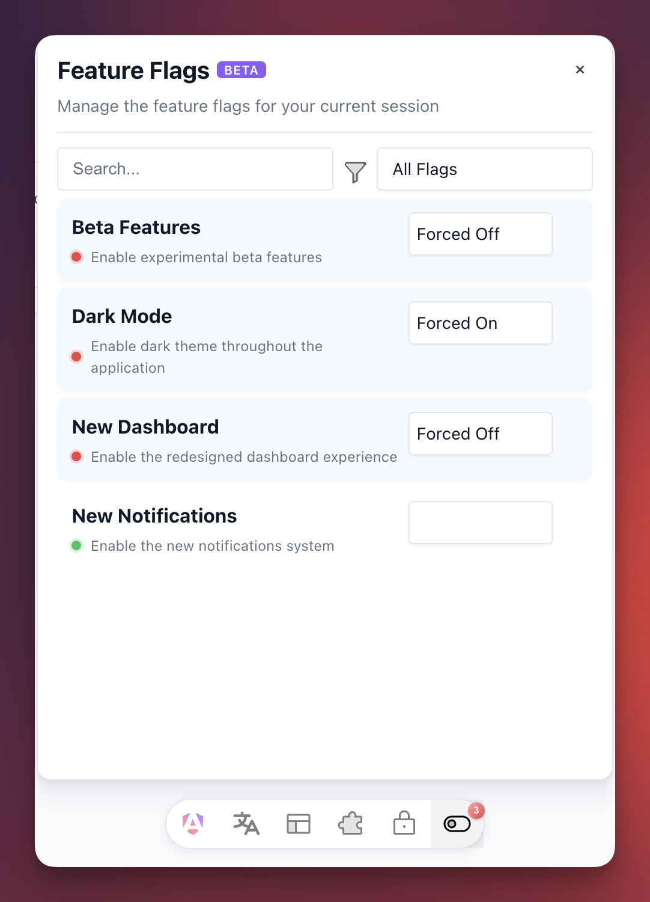

# Angular Toolbar

<div align="center">

[](https://www.npmjs.com/package/ngx-dev-toolbar)
[](https://www.npmjs.com/package/ngx-dev-toolbar)
[](https://angular.dev/)
[](LICENSE)

**A development toolbar for Angular applications.**

[Documentation](https://alfredoperez.github.io/ngx-dev-toolbar/) · [Demo](https://alfredoperez.github.io/ngx-dev-toolbar/)


</div>

## Features

- **Feature Flags** - Override feature flags without backend changes
- **Permissions** - Test different user permission states
- **App Features** - Toggle application features by tier
- **Language** - Switch languages instantly
- **Presets** - Save and load configuration presets
- **Zero Bundle Impact** - Dynamic imports exclude toolbar from production

## Quick Start

### 1. Install

```bash
npm install ngx-dev-toolbar
```

### 2. Initialize in main.ts

```typescript
import { bootstrapApplication } from '@angular/platform-browser';
import { isDevMode } from '@angular/core';

async function bootstrap() {
  const appRef = await bootstrapApplication(AppComponent, appConfig);

  if (isDevMode()) {
    const { initToolbar } = await import('ngx-dev-toolbar');
    initToolbar(appRef);
  }
}

bootstrap();
```

That's it! No template changes needed. The toolbar automatically attaches to the DOM.

## Tools

### Feature Flags

Configure available feature flags:

```typescript
import { ToolbarFeatureFlagService } from 'ngx-dev-toolbar';

@Component({...})
export class AppComponent {
  private featureFlags = inject(ToolbarFeatureFlagService);

  constructor() {
    this.featureFlags.setAvailableOptions([
      { id: 'darkMode', name: 'Dark Mode' },
      { id: 'betaFeatures', name: 'Beta Features' },
    ]);
  }
}
```



Get flags with overrides applied:

```typescript
@Component({...})
export class FeatureComponent {
  private featureFlags = inject(ToolbarFeatureFlagService);

  ngOnInit() {
    this.featureFlags.getValues().pipe(
      map(flags => flags.find(f => f.id === 'darkMode')),
      map(flag => flag?.isEnabled ?? false)
    ).subscribe(isDarkMode => {
      // Apply dark mode logic
    });
  }
}
```

### Permissions

```typescript
import { ToolbarPermissionsService } from 'ngx-dev-toolbar';

@Component({...})
export class AppComponent {
  private permissions = inject(ToolbarPermissionsService);

  constructor() {
    this.permissions.setAvailableOptions([
      { id: 'admin', name: 'Admin Access' },
      { id: 'editor', name: 'Editor Access' },
    ]);
  }
}
```

### App Features

```typescript
import { ToolbarAppFeaturesService } from 'ngx-dev-toolbar';

@Component({...})
export class AppComponent {
  private appFeatures = inject(ToolbarAppFeaturesService);

  constructor() {
    this.appFeatures.setAvailableOptions([
      { id: 'premium', name: 'Premium Features', tier: 'premium' },
      { id: 'basic', name: 'Basic Features', tier: 'basic' },
    ]);
  }
}
```

### Language

```typescript
import { ToolbarLanguageService } from 'ngx-dev-toolbar';

@Component({...})
export class AppComponent {
  private language = inject(ToolbarLanguageService);

  constructor() {
    this.language.setAvailableOptions([
      { code: 'en', name: 'English' },
      { code: 'es', name: 'Spanish' },
      { code: 'fr', name: 'French' },
    ]);
  }
}
```

## Configuration

Customize which tools are visible:

```typescript
initToolbar(appRef, {
  config: {
    showFeatureFlagsTool: true,
    showPermissionsTool: true,
    showLanguageTool: true,
    showAppFeaturesTool: true,
    showPresetsTool: true,
  }
});
```

### Keyboard Shortcuts

- **Ctrl+Shift+D** - Toggle toolbar visibility

## API Reference

All tool services implement the `ToolbarService<T>` interface:

| Method | Description |
|--------|-------------|
| `setAvailableOptions(options: T[])` | Set options displayed in the tool |
| `getValues()` | Get all values with overrides applied |
| `getForcedValues()` | Get only overridden values |

## Contributing

Contributions welcome! See [CONTRIBUTING.md](CONTRIBUTING.md).

## License

MIT
