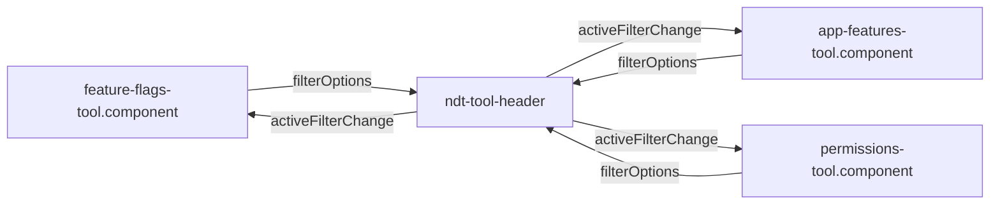

# Plan: Add All Filter

**Spec**: [spec.md](./spec.md) | **Date**: 2026-04-23

## Approach

Make the implicit `'all'` filter state visible by prepending an **All** chip to each tool's `filterOptions` array, then remove the click-to-deselect toggle in the shared `ToolbarToolHeaderComponent` since the explicit **All** chip now serves as the reset affordance. This keeps each tool's existing `FeatureFlagFilter` / `AppFeatureFilter` / `PermissionFilter` union (which already includes `'all'`) and its `activeFilter` signal default of `'all'` — no model changes, no persisted-state migrations. The only behavior change in the shared header is a one-line simplification: a chip click always sets `activeFilter` to the clicked value, never to a hidden default.

## Technical Context

**Stack**: Angular 21.1 standalone components, OnPush change detection, signal-based state (`signal()`, `computed()`, `model()`), TypeScript 5.5.
**Key Dependencies**: `ToolbarToolHeaderComponent` (shared), `ToolbarStorageService` for localStorage-persisted view state.
**Constraints**: All three tools must behave identically; no change to the filter-union types; `ToolViewState` persistence format stays unchanged for backwards compatibility.

## Architecture

Today only three tools consume `ndt-tool-header` with a `filterOptions` array (grep confirms). The change is isolated to those four files plus their specs.

## Files

### Create

_(none)_

### Modify

- `libs/ngx-dev-toolbar/src/components/tool-header/tool-header.component.ts` — remove the click-to-deselect branch in `onFilterClick` (the `if (this.activeFilter() === value)` guard that resets to `defaultFilter()`); drop the now-unused `defaultFilter` input and its doc comment. A click always sets `activeFilter` to the clicked value.
- `libs/ngx-dev-toolbar/src/tools/feature-flags-tool/feature-flags-tool.component.ts` — prepend `{ value: 'all', label: 'All' }` to `filterOptions`. No handler change needed: `onFilterChange` already looks up by `.find(f => f.value === value)` and will now succeed for `'all'`.
- `libs/ngx-dev-toolbar/src/tools/app-features-tool/app-features-tool.component.ts` — same change: prepend `{ value: 'all', label: 'All' }` to `filterOptions`.
- `libs/ngx-dev-toolbar/src/tools/permissions-tool/permissions-tool.component.ts` — same change: prepend `{ value: 'all', label: 'All' }` to `filterOptions`.
- `libs/ngx-dev-toolbar/src/tools/feature-flags-tool/feature-flags-tool.component.spec.ts` — update any `filterOptions.length`/index-based assertions to expect the new All-first ordering; add a test covering the regression case from the spec (clicking the same chip twice keeps it active).
- `libs/ngx-dev-toolbar/src/tools/app-features-tool/app-features-tool.component.spec.ts` — same spec updates.
- `libs/ngx-dev-toolbar/src/tools/permissions-tool/permissions-tool.component.spec.ts` — same spec updates (existing assertions at lines 142–145 hard-code `length === 3` and `[0].value === 'forced'`; both need updating).

## Testing Strategy

- **Unit**: Jest component specs for all three tools. Assert (a) `filterOptions` has 4 entries with `'all'` at index 0; (b) `onFilterChange('all')` sets `activeFilter` to `'all'` and the filtered-list computed returns every item; (c) clicking an already-active chip (simulated by calling `onFilterChange` twice with the same value) leaves `activeFilter` unchanged.
- **Integration**: Existing `loadViewState` tests already cover legacy persisted `'all'` values — no new tests needed for backwards-compat.
- **Edge cases**: None beyond the scenarios listed in spec.md; the per-tool filter logic itself is untouched.

## Risks

- **Shared-header behavior change**: Removing click-to-deselect in `ToolbarToolHeaderComponent` is a visible UX shift — but the component is only consumed by the three tools being updated in the same PR, so the blast radius is contained. Mitigation: audit `grep ndt-tool-header` before merge (confirmed only 3 call sites today) and call out the behavior change in the commit message.
