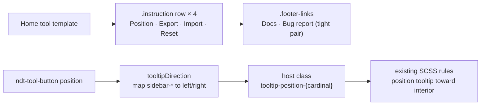

# Plan: Home Tool Redesign

**Spec**: [spec.md](./spec.md)

## Approach

Reshape the Home Tool into a clean settings-row stack — every row uses the existing `.instruction` pattern (label + helper text + right-aligned control), including a new **compact segmented control** for **Toolbar Position** in place of the full-width segmented bar (`ndt-select` is the width-constrained fallback). Pair that with three small chrome fixes: a `tooltipDirection` computed in `tool-button.component.ts` that maps `sidebar-left`/`sidebar-right` onto the existing cardinal `left`/`right` CSS rules so tooltips render *toward* the viewport interior (cardinal `left`/`right` already render correctly — only the two sidebar positions need remapping); a hover treatment on `.control--close` that matches the rest of the header (option A: neutral hover for full sibling parity; option B: a soft 8% danger tint that preserves muscle memory while dropping the loud red — final pick before `/sdd:tasks`); and a curated 2-link footer (Docs, Bug report) with `justify-content: flex-start` so the pair sits tight, not stretched. The change is CSS-and-template-first — no new dependencies, no new components, no logic beyond the tooltip mapping and the position-row control binding.

## Architecture

## Files

### Create

*(none — no new files)*

### Modify

- `libs/ngx-dev-toolbar/src/tools/home-tool/home-tool.component.ts` — (a) replace the `.position-selector` segmented bar block with an `.instruction` row whose `__control` slot contains a **compact segmented control** (six abbreviated keys: `top | bottom | left | right | ◧ sidebar-L | ◨ sidebar-R`, sized to its content, sitting in the right-aligned slot), bound to `state.position()` via a click handler. **Fallback:** if the 6-key strip overflows the row at small/medium window widths, swap to `ndt-select` (same `.instruction__control` slot, same `state.position()` binding). (b) Trim `links` to `[Docs, Bug report]` only; drop Suggestions / Star / Community.
- `libs/ngx-dev-toolbar/src/tools/home-tool/home-tool.component.scss` — (a) remove the `.position-selector` block (lines ~93–131); (b) **R007** — add a top border / `padding-top` to the *first* "Data" row (Export Settings) so the divider sits between the Position row and the Export/Import/Reset cluster, mirroring the `.instruction--danger-zone` divider treatment but quieter. (c) **footer fix** — change `.footer-links { justify-content: space-between }` (line 142) to `justify-content: flex-start; gap: var(--ndt-spacing-md);` so the 2 remaining links read as a tight pair, not a stretched bar.
- `libs/ngx-dev-toolbar/src/components/tool-button/tool-button.component.ts` — (a) add `readonly tooltipDirection = computed(() => mapToCardinal(this.position()))` where `sidebar-left → 'left'`, `sidebar-right → 'right'`, all four cardinal positions pass through unchanged; (b) change the host class binding from `'tooltip-position-' + position()` to `'tooltip-position-' + tooltipDirection()`. No new SCSS — the existing `:host(.tooltip-position-left)` / `:host(.tooltip-position-right)` rules already point the tooltip toward the viewport interior, which is exactly what sidebar mode needs.
- `libs/ngx-dev-toolbar/src/components/window/window.component.scss` — two related touches:
  - **R004 close-button hover** — pick **option A**: delete the `.control--close:hover { background: var(--ndt-hover-danger); }` override entirely so close inherits the sibling `.control:hover` neutral treatment (`var(--ndt-hover-bg)` + `var(--ndt-text-primary)`). Or **option B**: replace the override with `background: rgba(var(--ndt-danger-rgb), 0.08); color: var(--ndt-danger);` for a soft, intentional close-only accent. Pick before tasks. **NFR003** — verify contrast in both themes after the change.
  - **R006 header pass (default mode)** — `.ndt-header { align-items: flex-start }` (line 38) makes header controls hug the top of multi-line title blocks. Verify in browser; if controls feel high above the title row, change default-mode `.ndt-header` to `align-items: center` and rely on the existing compact override (line 54) to keep compact mode centered too. May be a no-op edit — confirm visually before committing.

## Testing Strategy

- **Unit**: extend `tool-button.component.spec.ts` (or add if missing) with cases `position='sidebar-left' → host class includes 'tooltip-position-left'` and `position='sidebar-right' → host class includes 'tooltip-position-right'`. Cardinal positions remain unchanged. Jest, AAA pattern.
- **Visual / manual**: serve the demo (`nx serve demo`), exercise all six toolbar positions (top, bottom, left, right, sidebar-left, sidebar-right), verify (a) tooltip appears on the inward side in sidebar modes, (b) close-button hover matches the picked option (neutral or soft accent), (c) Home Tool position row reads as a settings row and footer shows only 2 links sitting tight on the left, (d) header alignment in default mode looks balanced against the title block.
- **Edge cases**: tooltip on the *very last* tool button near the viewport edge in sidebar mode (no clipping); keyboard reach across the segmented control — Tab onto the strip, Arrow keys move between segments, `:focus-visible` outline preserved (NFR001); reduced-motion preference doesn't break the close-button transition.

## Risks

- **Segmented-control width in narrow windows**: 6 keys may overflow the right slot at `size: 'small'` (320 px). Mitigation: the fallback `ndt-select` is already named in the modify entry — if visual check during tasks shows overflow, switch to the fallback without revisiting the plan.
- **Close-button hover muscle memory** (option A vs B): going fully neutral could feel under-signalled to users who built the "× turns red" association from current builds. Soft-accent option B preserves the cue while killing the loud red. Either is on-brand per DESIGN.md (close hover is *functional*, not decorative annotation). Pick at tasks.
- **Tooltip-direction mapping is the only TS change** — low blast radius, but if any other component reads the raw `position()` host class for tooltip purposes, it would silently lose that signal. Mitigation: a single `grep` for `tooltip-position-` confirms the class is consumed only by `tool-button.component.scss`.
