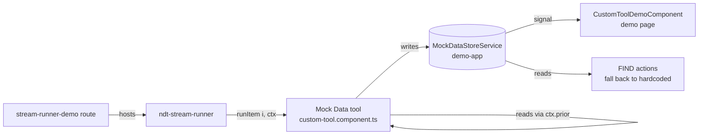

# Plan: Mock Tool Polish

**Spec**: [spec.md](./spec.md)

## Approach

Evolve `StreamStep<T>.runItem` to accept an optional second argument — a `StreamRunContext` that exposes items completed in prior steps of the same run — and pass it from the runner without changing call-site semantics for existing single-arg callbacks. Introduce a demo-app `MockDataStoreService` as the single source of truth for entities created via the toolbar's bundles, so the demo wrapper page can mirror them live and FIND actions can return real prior creations. Round it off with a stream-runner showcase route in the demo (substituting for Storybook) and a new "Streaming runner" section in the custom-tool docs guide.

The key architectural choice is keeping the chaining context **purely a read-view over `StreamStepRecord.items[].value`** — the runner already accumulates these as steps resolve, so no extra buffering is needed and lookup stays O(1) per step. Backwards compatibility (R001) is structurally guaranteed: in TypeScript, a `(i) => Promise<T>` is assignable to `(i, ctx?) => Promise<T>`, so existing callers compile and run unchanged.

## Architecture

## Files

### Create

- `apps/ngx-dev-toolbar-demo/src/app/components/custom-tool/mock-data-store.service.ts` — In-memory store keyed by entity label (`Customers`, `Invoices`, …) using signals; exposes `add(label, items)`, `entities(label)`, and `clear()`. Lives in demo app, not library, since persistence is out of scope.
- `apps/ngx-dev-toolbar-demo/src/app/components/stream-runner-demo/stream-runner-demo.component.ts` — New showcase route hosting `<ndt-stream-runner>` with two scripted scenarios: a single-step quick-discovery flow and a multi-step generation flow that exercises the new chaining context (R005).
- `apps/ngx-dev-toolbar-demo/src/app/components/stream-runner-demo/stream-runner-demo.component.scss` — Page styles consistent with sibling demo pages.

### Modify

- `libs/ngx-dev-toolbar/src/components/stream-runner/stream-runner.models.ts` — Add `StreamRunContext` interface (`prior(stepIndexOrLabel: number | string): readonly unknown[]`); change `runItem` signature to `(index: number, ctx: StreamRunContext) => Promise<T>` (single-arg callers still satisfy this).
- `libs/ngx-dev-toolbar/src/components/stream-runner/stream-runner.component.ts` — Build a context object once per run that closes over `_records()`; pass it as the second argument to `step.runItem(itemIndex, ctx)` at line 276. The context resolves a step by index or label and returns `items.filter(it => it.status === 'done').map(it => it.value)` — but reads each step's items via cached references on `StreamStepRecord` (NFR001, O(1) per step access).
- `apps/ngx-dev-toolbar-demo/src/app/components/custom-tool/custom-tool.component.ts` — Inject `MockDataStoreService`. In `makeEntityStep.runItem`, after generating an entity, push it into the store under the step's label. Add an Invoices step variant whose `runItem` reads `ctx.prior('Customers')` and tags the new invoice with `customerId` matching a real prior customer (R002). Add FIND actions per CREATE bundle's first entity type (e.g. FIND → Customers) that read from the store; when empty, complete with zero items and a hint (R004 + Empty-state scenario). Keep existing FIND → Routes / FIND → DOM elements unchanged.
- `apps/ngx-dev-toolbar-demo/src/app/components/custom-tool-demo/custom-tool-demo.component.ts` — Replace the hardcoded "Finder/Maker" preview cards with a live grid that mirrors `MockDataStoreService` entities by label, falling back to an explanatory empty state when nothing has been generated yet (R003). Updates batch via signals (per-step rather than per-item, NFR002).
- `apps/ngx-dev-toolbar-demo/src/app/app.routes.ts` — Register `path: 'stream-runner'` lazy-loading the showcase component.
- `apps/ngx-dev-toolbar-demo/src/app/components/sidebar/sidebar.component.ts` — Add a `Stream Runner` nav item pointing at `/stream-runner`.
- `apps/docs/src/content/docs/guides/custom-tool.mdx` — Append a "Streaming Runner" section (after "Multi-Step Tools") covering `StreamStep`, `StreamRunOptions`, and the new chaining context, with the Mock Data tool's customer→invoice flow as the worked example (R006).

## Data Model

- `StreamRunContext` — fields: `prior(stepIndexOrLabel: number | string): readonly unknown[]` — **new** library-side interface; thin read-view exposing completed-item values from earlier steps in the current run.
- `StreamStep<T>.runItem` — signature: `(index: number, ctx: StreamRunContext) => Promise<T>` — **modified** (additive second parameter; existing single-arg callbacks remain valid).
- `MockDataStore` — fields: `entitiesByLabel: signal<Map<string, unknown[]>>` — **new** demo-app service; mutated by bundle `runItem`s, observed by the wrapper page and FIND actions.

## Testing Strategy

- **Unit (library)**: extend stream-runner's existing tests with a chaining-context case — a two-step run where step 2's `runItem` reads `ctx.prior(0)` and asserts it sees step 1's resolved values.
- **Unit (back-compat)**: ensure existing single-arg `runItem` tests still pass with no changes (compile-time + runtime).
- **Manual**: run the Billing bundle via the toolbar; confirm each invoice's `customerId` matches one of the customers from step 1; open the demo page mid-run and confirm entities appear live; run FIND → Customers with an empty store and confirm the hint shows.

## Risks

- **Public-API surface change**: even though the new parameter is optional, `StreamStep<T>` is exported from the library. Mitigation: ship as additive, document in the docs guide, keep release as a `feat` rather than `feat!` since existing code is source- and binary-compatible.
- **Demo-page churn under bursty creates (NFR002)**: signaling 50 individual `add(label, item)` calls would push 50 DOM updates. Mitigation: have `MockDataStoreService.add()` accept arrays and have the bundle steps batch per-step (push the whole step's items at the step boundary) rather than per-item.
- **FIND fallback ambiguity**: spec's R004 says "fall back to hardcoded sample" but the Empty-state scenario describes empty + hint. Mitigation: only entity types that *have* a hardcoded sample today (Routes, DOM elements) keep that fallback; new bundle-mirroring FIND types (Customers, etc.) show empty + hint, since there's no hardcoded list for them.
